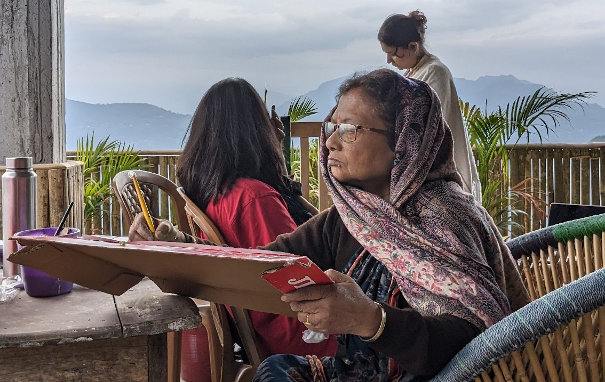
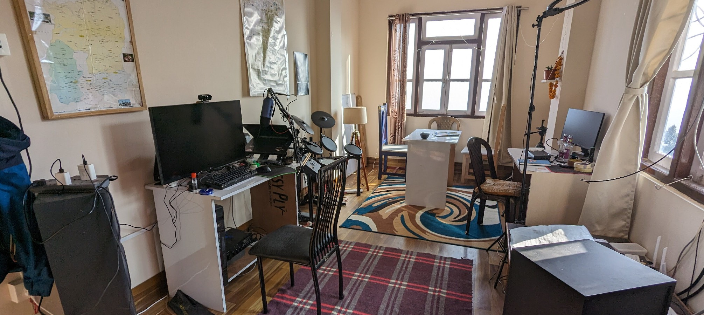
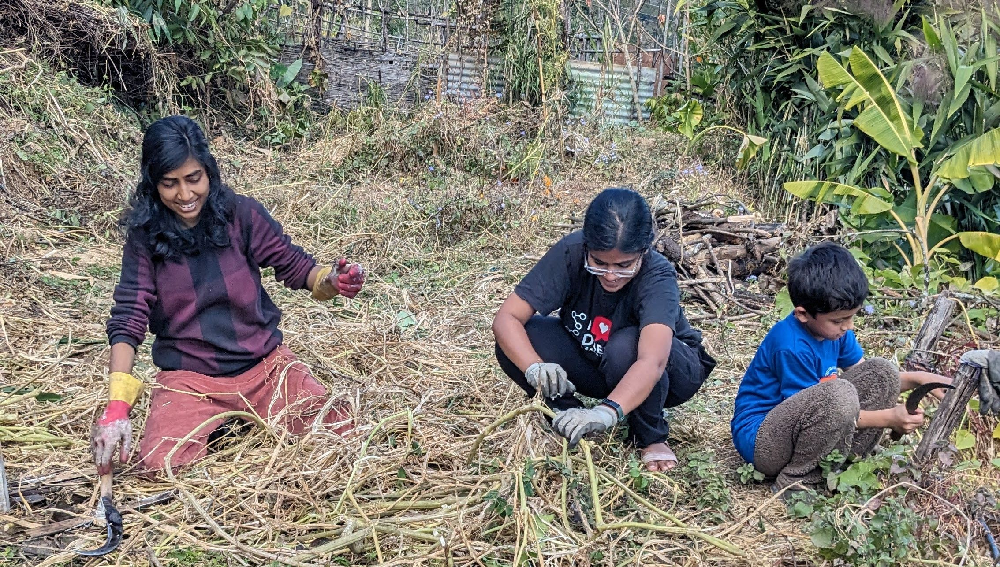

This is the repository that hosts the website for [Curry Hostel](https://curryhostel.com/).

We are a tiny hostel, co-living space, workspace and art space in a small Himalayan village in Sikkim, India. Slow is the way of life here and that is how we operate.

Here is the content from our homepage:

# Why Curry Hostel?

Curry Hostel is my ([Sumit](https://github.com/brainless)) way of building the future I believe in. A place where we focus inward, grow, rest, slow down, think and act. We eat well, we breathe fresh air, take care of animals and plants around us. A place where talking to the neighbors is easy, a place to explore and just be. A place that is part of nature we belong to.

# How do we operate?

Our pace is slow, we are not rushed and will not be. We do not support short term stays and allow a minimum booking of 1 week. This is because I believe we need time to slow down from the running-around-crazy-in-the-city-state. Do not be in a rush, that is not how we operate. Curry Hostel exists for a purpose and is always welcome to like-minded people. People who understand the damage that our ultra-capitalistic ways have caused. It is a step toward an alternate future. Come and build a future of tolerance, empathy, care, arts, music, philosophy, science. For everyone.

# About Temi and the hostel

Temi is a small village in south Sikkim. It has lots of farms and the neighborhood is pretty. There is a very large tea estate run by the Government of Sikkim. Forests are everywhere. There are many groups of houses or huts (as we call “bustee”) all over the place.

Curry Hostel is in a building with four floors. The space allows anyone to experience a slow life while still having most of the basic amenities of a home. We have a lot of art supplies at the hostel. We have a Roland TD 17 electronic drums set, a Yamaha keyboard and getting a guitar. We have a fully equipped kitchen including a dishwasher and backing oven. We have a separate work room with broadband Internet, power backup and a space for arts.

# How did we land here?

I am Sumit and I am from Kolkata. I moved to Temi, Sikkim in 2020 during the pandemic. After living here for about 18 months, I wanted to share the slow living experience. That is how Curry Hostel started. My parents are also living in Temi since 2023. I have given up on city life. I am a software engineering leader with lots of startup experience across India, Germany and the US. I have traveled much and still do.

# Technical background

The website is created with Astro, using the Starlight documentation setup and theme. It is hosted with CloudFlare Pages.
