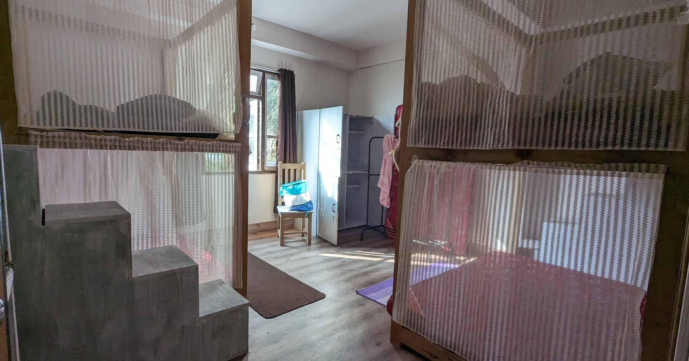
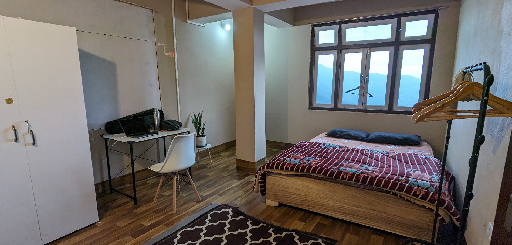

# Accommodation

Cost (per person) for one week stay (dorm room) is Rs. 4000 (we do not accept booking less than 1 week). We have a fully equipped kitchen where you can prepare your meals. We store most of the food supplies for breakfast, lunch and dinner but you have to prepare them yourself.

We do **NOT** have any attached washrooms. All our washrooms are shared (there is one close to each room).

If you want to stay in our double bed room then the cost is Rs 8000 per week.

We have a single private room that costs Rs 6000 per week.

We do **NOT** have any attached washrooms. All our washrooms are shared (there is one close to each room).

# Long term stays

If you are staying for 4 weeks or more, then you can get up to 25% off. Please message us on Instagram and we can discuss a package that makes your stay budget-friendly.

If you are an budding artist (visual or performing), writer, poet, novelist and have a creative profile online you can get additional discounts. Please message us on Instagram.

# What is the booking process?

We do not take any advance payment for bookings.

1. Please message me on [Instagram](https://www.instagram.com/curryhostel/)
2. Please check your travel options (you will have to arrive at Siliguri, West Bengal and then take local transport to Sikkim)
3. We need **travel tickets as confirmation**

[How to reach Curry Hostel](https://www.notion.so/How-to-reach-Curry-Hostel-af822174da754bb9b97bb61ec4927f53?pvs=21)
