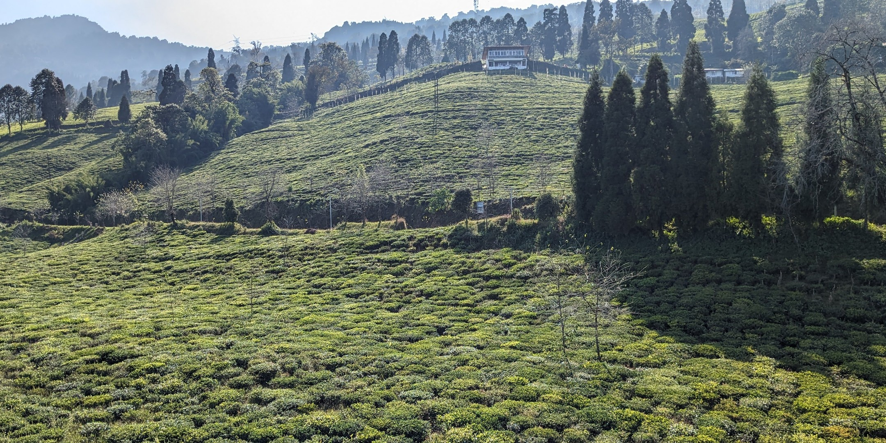
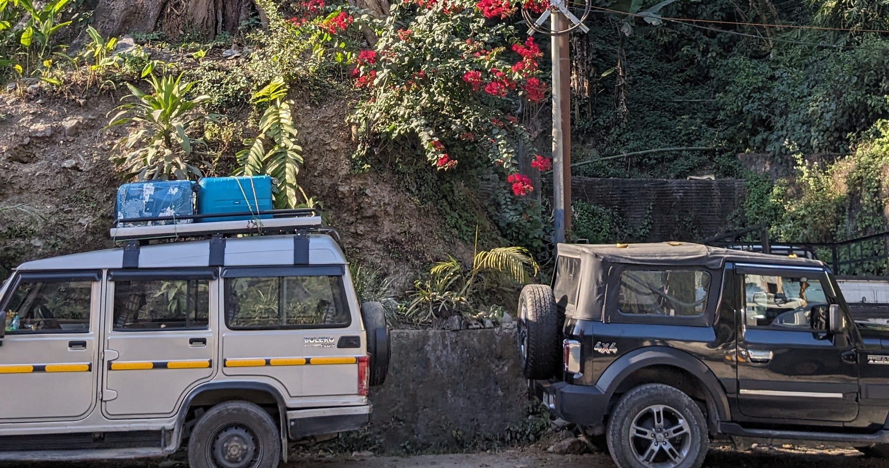

**Note**: Please carry your Voter ID card, Passport or Aadhaar card with you for
your travel, we need to show this at the local police station.

## Travel to Siliguri (West Bengal)

Your travel plan to Curry Hostel would be through Siliguri (West Bengal). Siliguri is the last major city in West Bengal before climbing on to the Himalayan belt of West Bengal (like Darjeeling, Kalimpong) and Sikkim.

You can reach Siliguri by:

- Train to New Jalpaiguri (NJP)
- Flight to Bagdogra (IXB)
- Bus (for travelers from West Bengal or Bihar)

### Bus or train from Kolkata to Siliguri

If you want to travel from any city like Mumbai, Bangalore, Pune, Chennai, etc to Kolkata, then you can take either a train to NJP (in Siliguri) or the overnight bus to Siliguri. Trains and busses are both comfortable, from Kolkata to Siliguri. You can check [Redbus](https://www.redbus.in/bus-tickets/siliguri-to-kolkata) (change dates) and look for operators with Volvo 9600 series buses (seats and sleepers available).

## Travel from Siliguri to Temi (Sikkim)

### Come directly to Temi

**If you you arrive in Siliguri around noon**: you can take a seat in the shared cab that comes directly to Temi. Come to the SNT (Sikkim Nationalized Transport) bus terminal and ask for the
Temi/Tarku service (shared cab) stand. Each seat is about Rs 500.

Temi - Siliguri shared service operators:

- Maila: +918670636225
- Saila: +918391959646
- Satish (more on time): +919635075479

### Come to Temi via Singtam

**From morning till afternoon**: At Siliguri you can take a bus from the SNT (Sikkim Nationalized Transport) bus terminal or service (shared cab) to Singtam. Service (shared cabs) are available just outside the SNT terminal gate. A seat on the bus is about Rs 200 and about Rs 400 in a shared cab. The bus is usually more comfortable.

Alternatively you can book at [wizzride.com](http://wizzride.com/) for a shared AC Innova to Singtam (this is in Sikkim), Rs 1100 per seat.

Get down at the **Singtam Bridge**, come to the Temi/Tarku service (shared cab) stand and you can get:

- Shared ride to Temi, Rs 100 per person
- A private taxi to Temi, Rs 1200-1400 full taxi

Mention to get down for Curry Hostel, just one turning below the Temi Police Station.

Please try to reach Singtam by 17:30 in order to get the shared taxi. After that, you will only get a private taxi.
