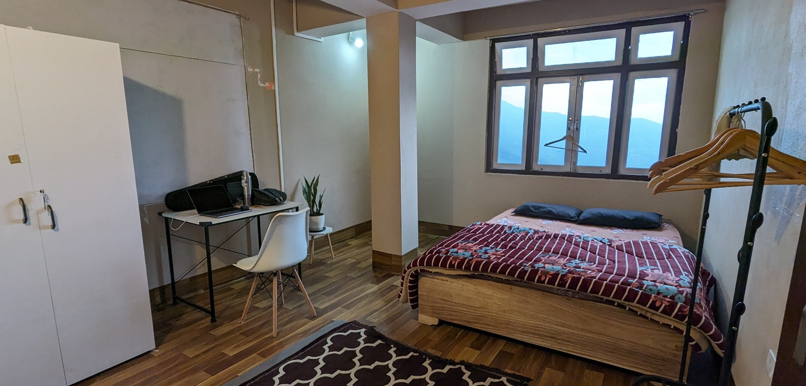

# Accommodation

Cost (per person) for two weeks stay (dorm room) is Rs. 6000. You can select any two weeks to come and stay (in May or June 2024). This is inclusive of lunch. We also store most of the food supplies for breakfast and dinner but you have to prepare them yourself. Dinner is generally a group activity.

We do **NOT** have any attached washrooms. All our washrooms are shared (there is one close to each room).

If you want to stay in our (only one) double bed room then the cost is Rs 12,000 for two weeks for two people.

We have a single private room that costs are Rs 9000 for two weeks.

We do **NOT** have any attached washrooms. All our washrooms are shared (there is one close to each room).

The **weekend trip** will be at an extra cost of Rs 3500 including shared cab, stay and all meals.

# What is the booking process?

We do not take any advance payment for bookings. For the retreat, we will need to coordinate the dates if you are interested in joining the weekend trip. Also, the activities at the Temi Senior Secondary School will happen on the first Saturday of each month (April to July).

1. Please message me on [Instagram](https://www.instagram.com/curryhostel/)
2. Please check your travel options (you will have to arrive at Siliguri, West Bengal and then take local transport to Sikkim)
3. We need **travel tickets as confirmation**
