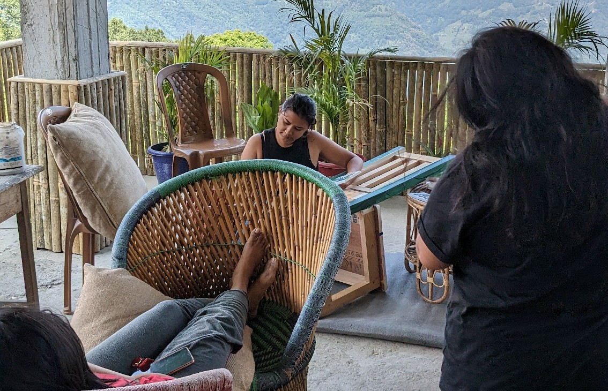
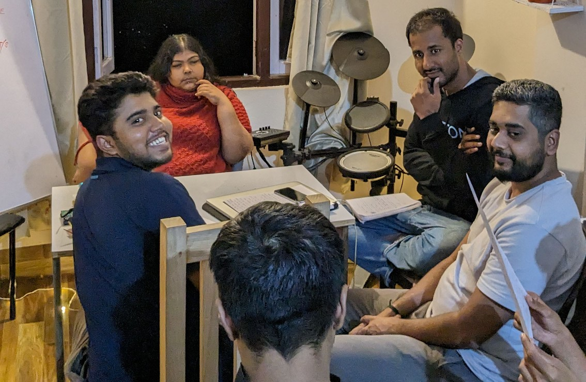
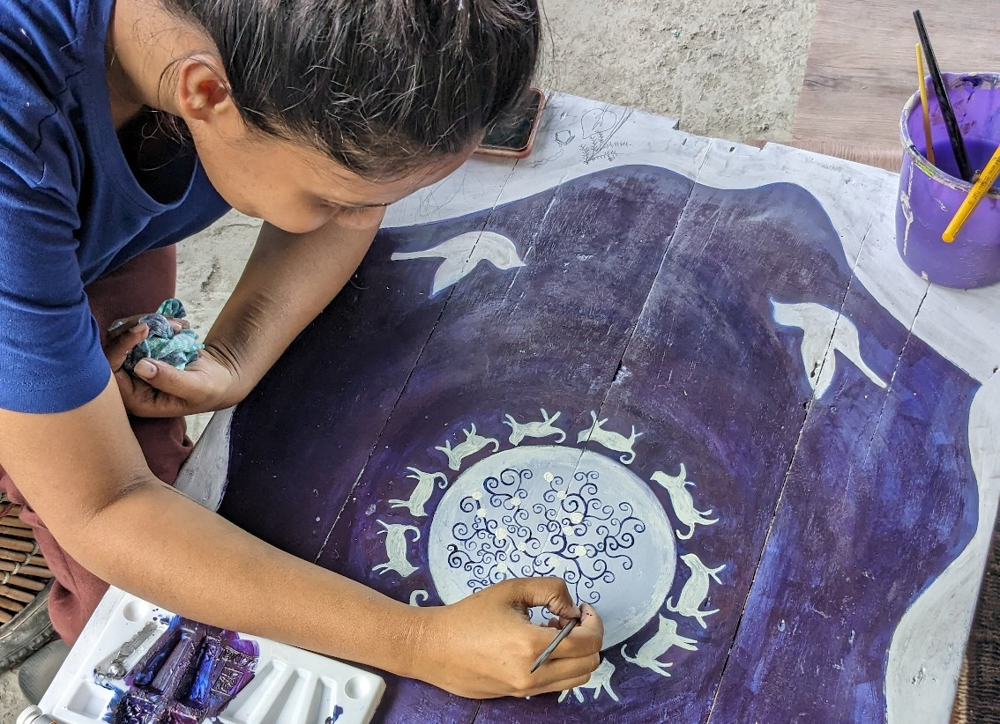
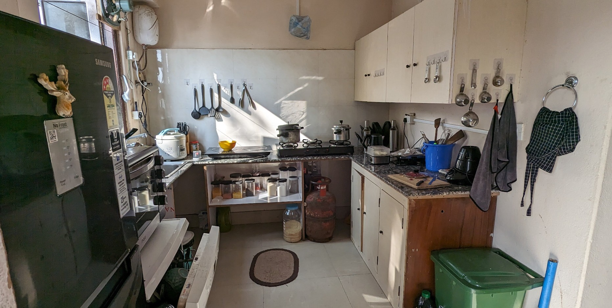
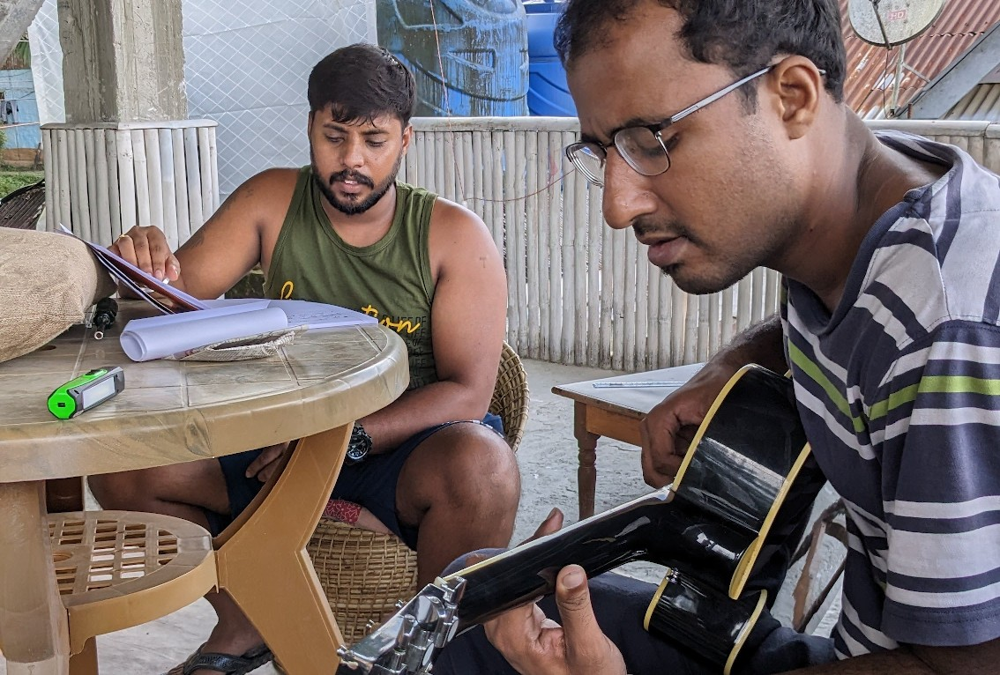
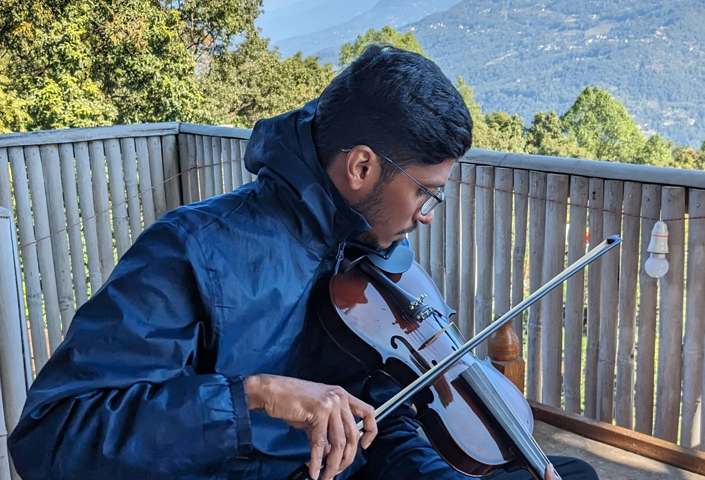
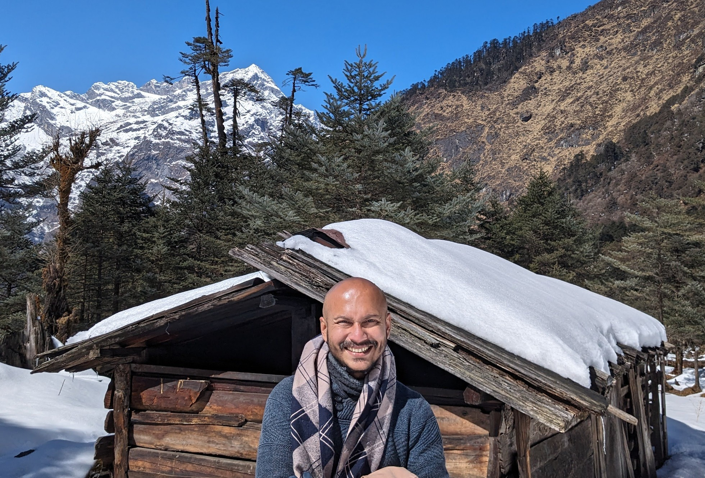

| When        | May and June, 2024                                                                               |
| ----------- | ------------------------------------------------------------------------------------------------ |
| Agenda      | No strict agenda, it is all about experiencing a slow life, and expressing yourself through arts |
| Stay period | Two weeks stay, you can select dates as per your plans                                           |

Village life here is very chilled and relaxed and allows the mind to breathe. It is my (I am Sumit btw) belief that we are disconnected from our own selves in the cities, unable to focus on our passions, build quality friendships and always in a state of chase. The countryside offers an opposite lifestyle and it is my personal opinion that this lifestyle helps us be more creative, calm and loving as human beings.

**Fun fact**: Temi has a tea estate and Temi tea is one of the highest quality export tea from India

# What do guests do?

You are free to simply exist here, eat well, breathe and relax. We do not set any other expectations. But we encourage you to walk through the fields or forests daily. We encourage you to go to the bazaar, talk to some of the shop owners, have a tea and some snacks, maybe paint someone’s wall. The Temi Senior Secondary School (public school, established in 1935) is the perfect place for meeting teachers and color the minds of a young-lings. Maybe organize a color or guitar workshop.

Remember those things you wanted to do when you were an 18-year old dreamy fool? Yeah, be that. That is what Curry Hostel stands for - back to our passions - our core identities, our innocence.

# Agenda for the retreat

We had our first retreat in 2023 with about 20 folks, mainly visual artists. This year, we are suggesting two weeks stay for everyone. Lunch is included. Breakfast is self-prepared and dinner can be a group activity. Our kitchen is central to our indoor social life. It is part of our large common area, including music, work and arts spaces. The retreat has **no set agenda** other than people creating and sharing; enjoying a slow life in the village.

We are talking to the Senior Secondary School at Temi to have an art (maybe even music) day there, once a month as part of this retreat. This will tentatively be the first Saturday of each month and involve students and teachers from the school along with all of the folks who will be here at Curry Hostel for the retreat.

# Suggested activities during the retreat

On Thursdays, we go to the haat (farmers market) and Deepa (our manager) prepares lunch with Nepali items. On weekends we usually go for hikes through the Temi tea estate or neighboring villages. Evenings are for movies, music, games and preparing dinner. We have a Roland drums kit, keyboard and getting a guitar.

I would also like to organize a budget weekend trip (2 nights, 3 days) to a popular location like [Yuksom](https://en.wikipedia.org/wiki/Yuksom) (West), [Zuluk](https://en.wikipedia.org/wiki/Dzuluk) (East) or [Lachung](https://en.wikipedia.org/wiki/Lachung) (North). If there are 6 people who want to join the trip on the same dates then we get our own cab, else we will need to share with other travelers.

## Links for further reading

[Volunteering](https://www.notion.so/Volunteering-31f56fae699d4f808742371abfc2ac84?pvs=21)

[Can I organize a workshop?](https://www.notion.so/Can-I-organize-a-workshop-e35cd09d06d646e181696b57040e7ea2?pvs=21)

[Costs and booking (retreat)](https://www.notion.so/Costs-and-booking-retreat-1100fe316ad6407b9508d5a5f12e5690?pvs=21)

[How to reach Curry Hostel](https://www.notion.so/How-to-reach-Curry-Hostel-af822174da754bb9b97bb61ec4927f53?pvs=21)

[Things to carry for your stay](https://www.notion.so/Things-to-carry-for-your-stay-3e0653fb06e0450a8cc5355be1fcf9d8?pvs=21)
